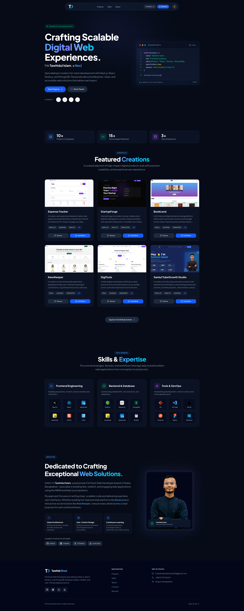

# 🚀 Tawhidul Islam — Portfolio Website

A modern, fully responsive personal portfolio website built with **Next.js, React, Node.js and MongoDB**, showcasing my projects, skills, and professional journey as a Full Stack Web Developer.

🔗 **Live Site:** [tawhid-dev-portfolio.vercel.app](https://tawhid-dev-portfolio.vercel.app/)

---

## 📸 Preview

<!--
  Add a real screenshot of the live site here.
  1) Take a screenshot of https://tawhid-dev-portfolio.vercel.app/ (full page is best)
  2) Save it inside your repo, e.g. public/preview.png (or a /screenshots folder)
  3) Replace the path below with that file's path
-->


---

## 👨‍💻 About

Hi, I'm **Tawhidul Islam**, a passionate Full Stack Web Developer based in Bogura, Bangladesh. I specialize in building fast, resilient, and engaging web applications using the **MERN** and **Next.js** ecosystems, with a focus on clean architecture and user-centric design.

## ✨ Features

- Fully responsive, modern UI/UX
- Animated hero and interactive sections
- Dynamic **Projects** showcase with live demo & source links
- **Skills & Expertise** section (Frontend, Backend, Tools & DevOps)
- **About Me** section with a personal introduction
- Direct contact links (LinkedIn, GitHub, X, LeetCode) and downloadable resume
- SEO-friendly meta tags and Open Graph support

## 🛠️ Tech Stack

**Frontend:** Next.js, React, TypeScript, JavaScript, HTML5, CSS3, Tailwind CSS
**Backend & Database:** Node.js, Express.js, MongoDB
**Tools & Deployment:** Git, VS Code, Vercel, Postman, Figma

## 📂 Featured Projects

| Project | Description | Links |
|---|---|---|
| **Expense Tracker** | Manage daily expenses with filtering & interactive charts | [Source](https://github.com/tawhidzihad/expense-tracker-app) · [Demo](https://expense-tracking-app-by-tawhid.vercel.app/) |
| **StartupForge** | A platform connecting startup founders with collaborators | [Source](https://github.com/tawhidzihad/startupforge-client) · [Demo](https://startupforge-platform.vercel.app/) |
| **BookLend** | A digital book borrowing platform with secure auth | [Source](https://github.com/tawhidzihad/assignment-008-nextjs-app) · [Demo](https://book-lend-ten.vercel.app) |
| **KeenKeeper** | A social tracking app for logging interactions & analytics | [Source](https://github.com/tawhidzihad/assignment-007-react-app) · [Demo](https://kinkeeper-psi.vercel.app/) |
| **DigiTools** | A digital marketplace for premium tools & subscriptions | [Source](https://github.com/tawhidzihad/assignment-006-react) · [Demo](https://digitoolspremium.netlify.app/) |
| **Samiul TubeGrowth Studio** | A portfolio site with admin dashboard for content management | [Source](https://github.com/tawhidzihad/samiul-portfolio-client) · [Demo](https://samiul-tubegrowth-studio.vercel.app) |

## 🚀 Getting Started

Clone the repository and run it locally:

```bash
git clone https://github.com/tawhidzihad/my-portfolio.git
cd my-portfolio
npm install
npm run dev
```

Open [http://localhost:3000](http://localhost:3000) in your browser to see the result.

## 📬 Contact

- **Email:** tawhidulislamzihad39@gmail.com
- **LinkedIn:** [tawhidulislamzihad](https://www.linkedin.com/in/tawhidulislamzihad)
- **GitHub:** [tawhidzihad](https://github.com/tawhidzihad)
- **X (Twitter):** [@tawhidzihad_dev](https://x.com/tawhidzihad_dev)
- **LeetCode:** [tawhiddev](https://leetcode.com/u/tawhiddev/)

## 📄 License

**Copyright © 2026 Tawhidul Islam. All Rights Reserved.**

This project and all of its source code, design, and assets are the exclusive property of Tawhidul Islam. No part of this repository may be copied, reproduced, distributed, modified, or used — in whole or in part — for any purpose without the **prior explicit written permission** of the author.

You are welcome to **view** the code for learning and reference purposes, but you may **not**:

- Copy or redistribute this code (as-is or modified)
- Use this code, in whole or in part, in your own personal or commercial projects
- Claim this work, or any derivative of it, as your own

For permission requests, please contact **tawhidulislamzihad39@gmail.com**.

---

<p align="center">Made with by <b>Tawhidul Islam</b></p>
